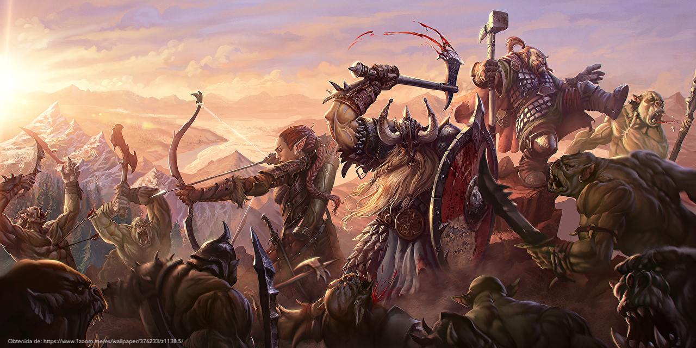

### FIT - Universidad Católica del Uruguay

# Encuentros futuros de la Tierra Media

En este juego, varios personajes cobrarán vida en la Tierra Media.

## Personajes [Characters]

Existen diferentes tipos de personajes provenientes de distintas especies.

### [Magos _[Wizards]_](https://lotr.fandom.com/wiki/Wizards)

Los magos, también conocidos como Istari, tienen el dominio de la mágia, que provee capacidades de ataque y de defensa. La mágia es innata a ellos, aunque pueden adquirir más mediente el estudio de la asignatura, y mediante elementos que la potencian (por ejemplo, un [bastón mágico](https://ringsdb.com/bundles/cards/142008.png)).

### [Elfos _[Elves]_](https://lotr.fandom.com/wiki/Elves)

Los elfos son criaturas supernaturales que también poseen características mágicas, y en general son conocidos por ayudar a los demás.

### [Enanos _[Dwarves]_](https://lotr.fandom.com/wiki/Dwarves)

Los enanos son seres temperamentales, muy buenos en combate con las armas, físicamente fuertes, con mucha resistencia y leales a sus amigos.

## Elementos _[Items]_

Los personajes necesitan de ciertos elementos para poder combatir con sus enemigos. Estos elementos pueden ser ropaje (túnica, por ejemplo), armas (como un hacha o una espada), entre otros. 

Existe un elemento particularmente interesante, llamado libro de hechizos. El libro de hechizos es tan poderoso como hechizos tenga en él, y representa el conocimiento de un mago.

# Desafío

## Parte 0: Repo

Cada equipo deberá crear un repo para el desarrollo de este juego. Todos los miembros del equipo deberán tener acceso al repo.

## Parte 1: Modelado

En equipo, modelen las clases y las colaboraciones que son necesarias para representar los elementos del juego mencioandos.

Recuerden: los personajes deben poder tener items. Por ejemplo, los magos pueden tener un bastón mágico, un libro de hechizos (con hechizos), etc.

Deberán crear y subir al repositorio el modelo en forma de diagrama de clases.
<svg xmlns="http://www.w3.org/2000/svg" xmlns:xlink="http://www.w3.org/1999/xlink" version="1.1" width="641px" viewBox="-0.5 -0.5 641 623" content="&lt;mxfile host=&quot;app.diagrams.net&quot; modified=&quot;2023-04-26T22:33:42.753Z&quot; agent=&quot;5.0 (Windows)&quot; etag=&quot;mE7CURyT6jdk3D-WCkuL&quot; version=&quot;20.3.6&quot; type=&quot;device&quot;&gt;&lt;diagram id=&quot;PGICECondg32x7swq7dw&quot; name=&quot;Página-1&quot;&gt;7VzbbqM6FP0aHnsUcEjSxzTpmT60o5nJSDOvDjjBqsGRcXPp158N2LlBzsA0LkSyFCnxxhCz17LXZkHioEm8/SLwKnrhIWGO1wu3Dpo6nuf20AjessiuiPieCiwFDVWnQ2BG34neU0XfaEjSk46Scybp6jQY8CQhgTyJYSH45rTbgrPTb13hJSkFZgFm5egvGsqoiI684SH+ROgy0t/sDu6LLTHWndWZpBEO+eYohB4dNBGcy+JTvJ0QliVP56XY798LW/cDEySRdXbw5sQfSH/t8++/px7+fbcb/rxTR1lj9qZO+Bd9xyJUQ5Y7nYd0Q2OGE2g9LHgiZ2qLC23M6DKBzwEMhAgIrImQFFI4VhskX0E0iCgLn/GOv2XDTSUOXnXrIeKCvsNhMVPHhM1CKjZ4g5Mes2xPCPcgKkgKfb7pHLhnoRe8Pen4jFOpAgFnDK9SOt+fRozFkiYPXEoeq07lFOt8wRmS7VFIpfwL4TGRYgdd1Fak4Vf893qqvTmwyR2oWHTMJNRXLFYMXu6PfQAZPiicG2DulTB3PDjV3lccE3hz0DiHXtBk6UDuPbQd57nI+jwRzGDYuheFvJwzBRIjcwQFfyUTzjhQYprwgjqUsbOQZg8jC3mRO+kKBzCc57zPtH+I/FAJy0Ic9l2wfIpFNAxJkuHOJZa4ADlDdMVhyHlC/Qd4Qd4nvX98x4eBT6DtHtrwyroLOeEJnAumOQUIMGhDMhZVkON/Z9ifGaMZMqhHkKEpfqAKfpxhzGiOXYGxXhfdvwI4BqgYOSD6MwN8eueWUEdl1FEFwgzPCfvGUyopz44vir5nyP8J3FP20iQigpoE3a27LIwMgd6/sCiMZb7c2glvEvtRPez1ynB18P0S+I9sTTpVA/RuuAYY/W0J4Jta4ge2BPjEFcGvTZg9Q1ouAYa2BPhoCdAY9Pt+uxXAqEEFULEk2AXBIDfcnlePHL5niB33JXZMN1gsOlUj3LJP4A865xNoC85WCZ+yKNzXpkxXjAK37B7aMqFhmdAY9dadAveSf2itAuNTvn2rAJVFYby1VoEhq6BfuwrQBeL1Aa9a5LPpPiULkqSqEKi6KpjiOLu5ZteD2uvBfnLdjlOAqtTA1gCNaoDmsLftFaCyYwzr7KJbl4O3rAPnt427IASXTGMrBNcXgtuzjJH1jD8uBDdnGqOyazyLKGGhVQJDxmAXlKBsBlslMKUEo9qE6YoS9Kt8Y6sEzZSgMextK0G/fCH4gpc0gNCc81erB2Ycor08tCcH/aoHBq0cGJGD/Sy7ITmoerTQykEjOWgOe+tyUHYLfvC5vVFgSAaGdae5QRmoMgCsDJiRgUFtvnRGBqqeL7My0EwGGsPeugyUrYLn/FuzX+fFkAWrB9fRg/MbBh0QBP/S82NWEK4vCM2fHmtbEHz79NjHBaEx7G0Lgn5A+Qj1J4LXOysIhu8bdEEQrFH0eT8xuD2jyLdG0cd/ddQhowiah3+3yLcd/UcIevwP&lt;/diagram&gt;&lt;/mxfile&gt;" onclick="(function(svg){var src=window.event.target||window.event.srcElement;while (src!=null&amp;&amp;src.nodeName.toLowerCase()!='a'){src=src.parentNode;}if(src==null){if(svg.wnd!=null&amp;&amp;!svg.wnd.closed){svg.wnd.focus();}else{var r=function(evt){if(evt.data=='ready'&amp;&amp;evt.source==svg.wnd){svg.wnd.postMessage(decodeURIComponent(svg.getAttribute('content')),'*');window.removeEventListener('message',r);}};window.addEventListener('message',r);svg.wnd=window.open('https://viewer.diagrams.net/?client=1&amp;page=0&amp;edit=_blank');}}})(this);" style="cursor:pointer;max-width:100%;max-height:623px;"><defs><clipPath id="mx-clip-244-31-152-74-0"><rect x="244" y="31" width="152" height="74"/></clipPath><clipPath id="mx-clip-244-113-152-26-0"><rect x="244" y="113" width="152" height="26"/></clipPath><clipPath id="mx-clip-4-25-152-74-0"><rect x="4" y="25" width="152" height="74"/></clipPath><clipPath id="mx-clip-4-107-152-52-0"><rect x="4" y="107" width="152" height="52"/></clipPath><clipPath id="mx-clip-484-31-152-74-0"><rect x="484" y="31" width="152" height="74"/></clipPath><clipPath id="mx-clip-484-113-152-26-0"><rect x="484" y="113" width="152" height="26"/></clipPath><clipPath id="mx-clip-4-225-152-74-0"><rect x="4" y="225" width="152" height="74"/></clipPath><clipPath id="mx-clip-244-225-152-74-0"><rect x="244" y="225" width="152" height="74"/></clipPath><clipPath id="mx-clip-484-225-152-74-0"><rect x="484" y="225" width="152" height="74"/></clipPath><clipPath id="mx-clip-4-385-152-74-0"><rect x="4" y="385" width="152" height="74"/></clipPath><clipPath id="mx-clip-4-545-152-74-0"><rect x="4" y="545" width="152" height="74"/></clipPath><clipPath id="mx-clip-244-545-152-74-0"><rect x="244" y="545" width="152" height="74"/></clipPath><clipPath id="mx-clip-484-545-152-74-0"><rect x="484" y="545" width="152" height="74"/></clipPath></defs><g><path d="M 240 26 L 240 0 L 400 0 L 400 26" fill="rgb(255, 255, 255)" stroke="rgb(0, 0, 0)" stroke-miterlimit="10" pointer-events="all"/><path d="M 240 26 L 240 134 L 400 134 L 400 26" fill="none" stroke="rgb(0, 0, 0)" stroke-miterlimit="10" pointer-events="none"/><path d="M 240 26 L 400 26" fill="none" stroke="rgb(0, 0, 0)" stroke-miterlimit="10" pointer-events="none"/><g fill="rgb(0, 0, 0)" font-family="Helvetica" font-weight="bold" pointer-events="none" text-anchor="middle" font-size="12px"><text x="319.5" y="17.5">Wizard</text></g><g fill="rgb(0, 0, 0)" font-family="Helvetica" pointer-events="none" clip-path="url(#mx-clip-244-31-152-74-0)" font-size="12px"><text x="245.5" y="43.5">+ Name : string</text><text x="245.5" y="57.5">+ Health : int</text></g><path d="M 240 104 L 400 104" fill="none" stroke="rgb(0, 0, 0)" stroke-miterlimit="10" pointer-events="none"/><g fill="rgb(0, 0, 0)" font-family="Helvetica" pointer-events="none" clip-path="url(#mx-clip-244-113-152-26-0)" font-size="12px"><text x="245.5" y="125.5">+ Attack : int</text></g><path d="M 0 20 L 0 0 L 160 0 L 160 20" fill="rgb(255, 255, 255)" stroke="rgb(0, 0, 0)" stroke-miterlimit="10" pointer-events="none"/><path d="M 0 20 L 0 154 L 160 154 L 160 20" fill="none" stroke="rgb(0, 0, 0)" stroke-miterlimit="10" pointer-events="none"/><path d="M 0 20 L 160 20" fill="none" stroke="rgb(0, 0, 0)" stroke-miterlimit="10" pointer-events="none"/><g fill="rgb(0, 0, 0)" font-family="Helvetica" font-weight="bold" pointer-events="none" text-anchor="middle" font-size="12px"><text x="79.5" y="17.5">Elve</text></g><g fill="rgb(0, 0, 0)" font-family="Helvetica" pointer-events="none" clip-path="url(#mx-clip-4-25-152-74-0)" font-size="12px"><text x="5.5" y="37.5">+ Name : string</text><text x="5.5" y="51.5">+ Health : int</text></g><path d="M 0 98 L 160 98" fill="none" stroke="rgb(0, 0, 0)" stroke-miterlimit="10" pointer-events="none"/><g fill="rgb(0, 0, 0)" font-family="Helvetica" pointer-events="none" clip-path="url(#mx-clip-4-107-152-52-0)" font-size="12px"><text x="5.5" y="119.5">+ Attack : int</text><text x="5.5" y="133.5">+ Heal : int</text></g><path d="M 480 26 L 480 0 L 640 0 L 640 26" fill="rgb(255, 255, 255)" stroke="rgb(0, 0, 0)" stroke-miterlimit="10" pointer-events="none"/><path d="M 480 26 L 480 134 L 640 134 L 640 26" fill="none" stroke="rgb(0, 0, 0)" stroke-miterlimit="10" pointer-events="none"/><path d="M 480 26 L 640 26" fill="none" stroke="rgb(0, 0, 0)" stroke-miterlimit="10" pointer-events="none"/><g fill="rgb(0, 0, 0)" font-family="Helvetica" font-weight="bold" pointer-events="none" text-anchor="middle" font-size="12px"><text x="559.5" y="17.5">Dwarf</text></g><g fill="rgb(0, 0, 0)" font-family="Helvetica" pointer-events="none" clip-path="url(#mx-clip-484-31-152-74-0)" font-size="12px"><text x="485.5" y="43.5">+ Name : string</text><text x="485.5" y="57.5">+ Health : int</text></g><path d="M 480 104 L 640 104" fill="none" stroke="rgb(0, 0, 0)" stroke-miterlimit="10" pointer-events="none"/><g fill="rgb(0, 0, 0)" font-family="Helvetica" pointer-events="none" clip-path="url(#mx-clip-484-113-152-26-0)" font-size="12px"><text x="485.5" y="125.5">+ Attack : int</text></g><path d="M 0 220 L 0 200 L 160 200 L 160 220" fill="rgb(255, 255, 255)" stroke="rgb(0, 0, 0)" stroke-miterlimit="10" pointer-events="none"/><path d="M 0 220 L 0 302 L 160 302 L 160 220" fill="none" stroke="rgb(0, 0, 0)" stroke-miterlimit="10" pointer-events="none"/><path d="M 0 220 L 160 220" fill="none" stroke="rgb(0, 0, 0)" stroke-miterlimit="10" pointer-events="none"/><g fill="rgb(0, 0, 0)" font-family="Helvetica" font-weight="bold" pointer-events="none" text-anchor="middle" font-size="12px"><text x="79.5" y="217.5">Axe</text></g><g fill="rgb(0, 0, 0)" font-family="Helvetica" pointer-events="none" clip-path="url(#mx-clip-4-225-152-74-0)" font-size="12px"><text x="5.5" y="237.5">+ Defense :int</text><text x="5.5" y="251.5">+ Damage : int</text></g><path d="M 0 298 L 160 298" fill="none" stroke="rgb(0, 0, 0)" stroke-miterlimit="10" pointer-events="none"/><path d="M 240 220 L 240 200 L 400 200 L 400 220" fill="rgb(255, 255, 255)" stroke="rgb(0, 0, 0)" stroke-miterlimit="10" pointer-events="none"/><path d="M 240 220 L 240 302 L 400 302 L 400 220" fill="none" stroke="rgb(0, 0, 0)" stroke-miterlimit="10" pointer-events="none"/><path d="M 240 220 L 400 220" fill="none" stroke="rgb(0, 0, 0)" stroke-miterlimit="10" pointer-events="none"/><g fill="rgb(0, 0, 0)" font-family="Helvetica" font-weight="bold" pointer-events="none" text-anchor="middle" font-size="12px"><text x="319.5" y="217.5">Staff</text></g><g fill="rgb(0, 0, 0)" font-family="Helvetica" pointer-events="none" clip-path="url(#mx-clip-244-225-152-74-0)" font-size="12px"><text x="245.5" y="237.5">+ Defense :int</text><text x="245.5" y="251.5">+ Damage : int</text></g><path d="M 240 298 L 400 298" fill="none" stroke="rgb(0, 0, 0)" stroke-miterlimit="10" pointer-events="none"/><path d="M 480 220 L 480 200 L 640 200 L 640 220" fill="rgb(255, 255, 255)" stroke="rgb(0, 0, 0)" stroke-miterlimit="10" pointer-events="none"/><path d="M 480 220 L 480 302 L 640 302 L 640 220" fill="none" stroke="rgb(0, 0, 0)" stroke-miterlimit="10" pointer-events="none"/><path d="M 480 220 L 640 220" fill="none" stroke="rgb(0, 0, 0)" stroke-miterlimit="10" pointer-events="none"/><g fill="rgb(0, 0, 0)" font-family="Helvetica" font-weight="bold" pointer-events="none" text-anchor="middle" font-size="12px"><text x="559.5" y="217.5">Shield</text></g><g fill="rgb(0, 0, 0)" font-family="Helvetica" pointer-events="none" clip-path="url(#mx-clip-484-225-152-74-0)" font-size="12px"><text x="485.5" y="237.5">+ Defense :int</text><text x="485.5" y="251.5">+ Damage : int</text></g><path d="M 480 298 L 640 298" fill="none" stroke="rgb(0, 0, 0)" stroke-miterlimit="10" pointer-events="none"/><path d="M 0 380 L 0 360 L 160 360 L 160 380" fill="rgb(255, 255, 255)" stroke="rgb(0, 0, 0)" stroke-miterlimit="10" pointer-events="none"/><path d="M 0 380 L 0 462 L 160 462 L 160 380" fill="none" stroke="rgb(0, 0, 0)" stroke-miterlimit="10" pointer-events="none"/><path d="M 0 380 L 160 380" fill="none" stroke="rgb(0, 0, 0)" stroke-miterlimit="10" pointer-events="none"/><g fill="rgb(0, 0, 0)" font-family="Helvetica" font-weight="bold" pointer-events="none" text-anchor="middle" font-size="12px"><text x="79.5" y="377.5">Magic book</text></g><g fill="rgb(0, 0, 0)" font-family="Helvetica" pointer-events="none" clip-path="url(#mx-clip-4-385-152-74-0)" font-size="12px"><text x="5.5" y="397.5">+ Defense :int</text><text x="5.5" y="411.5">+ Damage : int</text></g><path d="M 0 458 L 160 458" fill="none" stroke="rgb(0, 0, 0)" stroke-miterlimit="10" pointer-events="none"/><path d="M 0 540 L 0 520 L 160 520 L 160 540" fill="rgb(255, 255, 255)" stroke="rgb(0, 0, 0)" stroke-miterlimit="10" pointer-events="none"/><path d="M 0 540 L 0 622 L 160 622 L 160 540" fill="none" stroke="rgb(0, 0, 0)" stroke-miterlimit="10" pointer-events="none"/><path d="M 0 540 L 160 540" fill="none" stroke="rgb(0, 0, 0)" stroke-miterlimit="10" pointer-events="none"/><g fill="rgb(0, 0, 0)" font-family="Helvetica" font-weight="bold" pointer-events="none" text-anchor="middle" font-size="12px"><text x="79.5" y="537.5">Robe</text></g><g fill="rgb(0, 0, 0)" font-family="Helvetica" pointer-events="none" clip-path="url(#mx-clip-4-545-152-74-0)" font-size="12px"><text x="5.5" y="557.5">+ Defense :int</text><text x="5.5" y="571.5">+ Damage : int</text></g><path d="M 0 618 L 160 618" fill="none" stroke="rgb(0, 0, 0)" stroke-miterlimit="10" pointer-events="none"/><path d="M 240 540 L 240 520 L 400 520 L 400 540" fill="rgb(255, 255, 255)" stroke="rgb(0, 0, 0)" stroke-miterlimit="10" pointer-events="none"/><path d="M 240 540 L 240 622 L 400 622 L 400 540" fill="none" stroke="rgb(0, 0, 0)" stroke-miterlimit="10" pointer-events="none"/><path d="M 240 540 L 400 540" fill="none" stroke="rgb(0, 0, 0)" stroke-miterlimit="10" pointer-events="none"/><g fill="rgb(0, 0, 0)" font-family="Helvetica" font-weight="bold" pointer-events="none" text-anchor="middle" font-size="12px"><text x="319.5" y="537.5">Light armor</text></g><g fill="rgb(0, 0, 0)" font-family="Helvetica" pointer-events="none" clip-path="url(#mx-clip-244-545-152-74-0)" font-size="12px"><text x="245.5" y="557.5">+ Defense :int</text><text x="245.5" y="571.5">+ Damage : int</text></g><path d="M 240 618 L 400 618" fill="none" stroke="rgb(0, 0, 0)" stroke-miterlimit="10" pointer-events="none"/><path d="M 480 540 L 480 520 L 640 520 L 640 540" fill="rgb(255, 255, 255)" stroke="rgb(0, 0, 0)" stroke-miterlimit="10" pointer-events="none"/><path d="M 480 540 L 480 622 L 640 622 L 640 540" fill="none" stroke="rgb(0, 0, 0)" stroke-miterlimit="10" pointer-events="none"/><path d="M 480 540 L 640 540" fill="none" stroke="rgb(0, 0, 0)" stroke-miterlimit="10" pointer-events="none"/><g fill="rgb(0, 0, 0)" font-family="Helvetica" font-weight="bold" pointer-events="none" text-anchor="middle" font-size="12px"><text x="559.5" y="537.5">Heavy armor</text></g><g fill="rgb(0, 0, 0)" font-family="Helvetica" pointer-events="none" clip-path="url(#mx-clip-484-545-152-74-0)" font-size="12px"><text x="485.5" y="557.5">+ Defense :int</text><text x="485.5" y="571.5">+ Damage : int</text></g><path d="M 480 618 L 640 618" fill="none" stroke="rgb(0, 0, 0)" stroke-miterlimit="10" pointer-events="none"/></g></svg>

## Parte 2: Creación

Cada equipo deberá crear las clases representadas en el modelo anterior. Cada integrante deberá crear, al menos:

- Un personaje  🧙‍♂️

- Dos elementos ⚔️ 🛡

> Recuerden crear el libro de hechizos y sus hechizos (existe un solo _tipo_ de hechizo por ahora).

### Personajes

Los personajes tienen, además de sus items, un nombre y una cantidad de vida limitada. 

Sus items pueden además quitarse o cambiarse por otros similares (por ejemplo, darle a un mago un bastón mágico nuevo, o simplemente quitarle el que tiene).

### Elementos

Los elementos tienen un valor de ataque y un valor de defensa. Es posible que en algunos casos alguno de estos valores sea 0. Por ejemplo, un elemento "Armadura" puede tener valor de ataque 0.

> [Inspiración](https://ringsdb.com/find?q=t%3Aattachment)

## Parte 3: Cobrando poder

Agregar al proyecto el siguiente comportamiento:

- Obtener el valor total de ataque de un personaje. ⚔️

- Obtener el valor total de defensa de un personaje. 🛡

- Atacar a un personaje (disminuir su vida en cierta cantidad) 🗡

- Curar a un personaje (recuperar su vida inicial) 🚑

Justificar con comentarios en el código las decisiones que tomaron para resolver esta parte del desafío, incluyendo si utilizaron algun patrón o principio.

## Parte 4: Testing

Deberán escribir casos de test para probar su programa. Como equipo tendrán que evaluar qué casos de test son necesarios, y deberán incluír la justificación de cada caso de test como comentario en el código del proyecto.

Todos los integrantes del equipo deben participar de la escritura de tests (contribuyendo al menos uno de los casos).

